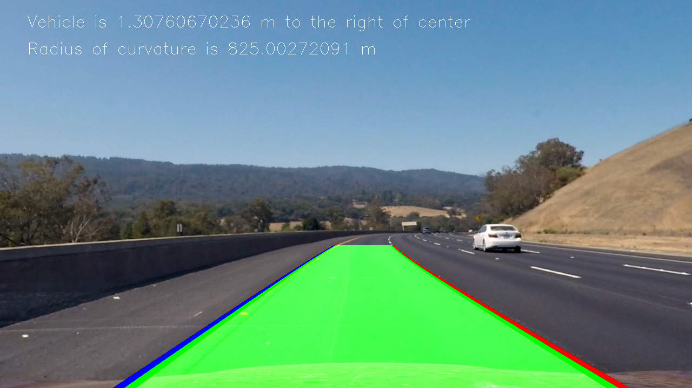

#Advanced Lane Finding Project

The goals / steps of this project are the following:

* Compute the camera calibration matrix and distortion coefficients given a set of chessboard images.
* Apply a distortion correction to raw images.
* Use color transforms, gradients, etc., to create a thresholded binary image.
* Apply a perspective transform to rectify binary image ("birds-eye view").
* Detect lane pixels and fit to find the lane boundary.
* Determine the curvature of the lane and vehicle position with respect to center.
* Warp the detected lane boundaries back onto the original image.
* Output visual display of the lane boundaries and numerical estimation of lane curvature and vehicle position.

## [Rubric](https://review.udacity.com/#!/rubrics/571/view) Points

### Here I will consider the rubric points individually and describe how I addressed each point in my implementation.  

---

### Writeup / README

#### 1. Provide a Writeup / README that includes all the rubric points and how you addressed each one.  You can submit your writeup as markdown or pdf. 

You're reading it!

### Camera Calibration

#### 1. Briefly state how you computed the camera matrix and distortion coefficients. Provide an example of a distortion corrected calibration image.

The code for this step is contained in the function compute_cam_calib and is illustrated in the second cell of the [scratchpad.ipynb](scratchpad.ipynb) IPython notebook

I start by preparing "object points", which will be the (x, y, z) coordinates of the chessboard corners in the world. Here I am assuming the chessboard is fixed on the (x, y) plane at z=0, such that the object points are the same for each calibration image.  Thus, `objp` is just a replicated array of coordinates, and `objpoints` will be appended with a copy of it every time I successfully detect all chessboard corners in a test image.  `imgpoints` will be appended with the (x, y) pixel position of each of the corners in the image plane with each successful chessboard detection.  

I then used the output `objpoints` and `imgpoints` to compute the camera calibration and distortion coefficients using the `cv2.calibrateCamera()` function.  I applied this distortion correction to the test image using the `cv2.undistort()` function and obtained this result: 

 


### Pipeline (single images)

#### 1. Provide an example of a distortion-corrected image.

To demonstrate this step, I will describe how I apply the distortion correction to one of the test images like this one:


There wasn't much distortion at the center. But we can see some distortion at the edges where the car appears to be shifted during correction

#### 2. Describe how (and identify where in your code) you used color transforms, gradients or other methods to create a thresholded binary image.  Provide an example of a binary image result.

I used a combination of color and gradient thresholds to generate a binary image (thresholding steps at lines # 352 through #362 in `process_image.py`).  Here's an example of my output for this step. I found hsv colorspace's v channel to be a little more effective than the hls s channel, so that's what I ultimately went with. However, depending on the time of the day we may wish to tweak this color space selection later on.


#### 3. Describe how (and identify where in your code) you performed a perspective transform and provide an example of a transformed image.

The code for my perspective transform is in the 19th code cell of the IPython notebook [sratchpad.ipynb](scratchpad,ipynb) titled **## Apply perspective transform to image** .I chose the hardcode the source and destination points in the following manner:

```python
bot_left = [100, 700]
top_left = [550, 460]
top_right = [732, 460]
bot_right = [1250, 700]

offset = 100
width = image.shape[1] - offset
height = image.shape[0] - offset

src = np.stack([top_left, top_right, bot_right, bot_left]).astype(np.float32)
dst = np.float32([ [offset, offset], 
                   [offset+width, offset], 
                   [offset+width, offset+height], 
                   [offset, offset+height]])
```

This resulted in the following source and destination points:

| Source        | Destination   | 
|:-------------:|:-------------:| 
| 550, 460      | 100, 100      | 
| 732, 460      | 1280,100      |
| 1250, 700     | 1280, 720     |
| 100, 700      | 100, 720      |

I verified that my perspective transform was working as expected by drawing the `src` and `dst` points onto a test image and its warped counterpart to verify that the lines appear parallel in the warped image.


#### 4. Describe how (and identify where in your code) you identified lane-line pixels and fit their positions with a polynomial?

To find the lanes, I created a histogram of the bottom part of the image. The histogram will naturally have 2 peaks for each of the lane markers. This peak gives us a location to mark as the center location to start searching from. 

Next, I divided the image into 9 levels vertically and for each level I search for lane pixels in a window with a certain margin around the location of the lane center from the previous level. Here's a graphic that shows this step


Next, I use polyfit to fit a 2nd order parabola polynomial to get a lane model fit. Here's the result


Next, I use the inverse perspective transform to recalculate the lane model pixels in the final image and color the left lane and right lane with red and blue color. The region between the lanes is colored green. This is described in the pic for rubric 6.

#### 5. Describe how (and identify where in your code) you calculated the radius of curvature of the lane and the position of the vehicle with respect to center.

Vehicle offset from center is computed in the function ##compute_cam_center## lines #318 through #328 in my code in `process_image.py`

Radius of curvature is computed in the function ##radius_of_curvature## lines #330 through #345 in my code in `process_image.py`

#### 6. Provide an example image of your result plotted back down onto the road such that the lane area is identified clearly.

I implemented this step in lines # through # in my code in `process_image.py` in the function `detect_lanes()`.  Here is an example of my result on a test image:



---

### Pipeline (video)

#### 1. Provide a link to your final video output.  Your pipeline should perform reasonably well on the entire project video (wobbly lines are ok but no catastrophic failures that would cause the car to drive off the road!).

Here's a [link to my video result](./out2_project_video.mp4)

---

### Discussion

#### 1. Briefly discuss any problems / issues you faced in your implementation of this project.  Where will your pipeline likely fail?  What could you do to make it more robust?

Here I'll talk about the approach I took, what techniques I used, what worked and why, where the pipeline might fail and how I might improve it if I were going to pursue this project further.  

The pipeline is setup to identify poor detections and accomodate a few edge cases. A sanity check is done on 
the detected lanes to find if
- The curvatures of the left and right lanes are similar
- The lanes are approximately 3.7 meters apart
- The lanes are roughly parallel

If any of these checks are not satisfied then the last best value is reported as the location of the lanes.

In addition to the sanity checks a form of smoothing over the lane results of the last 7 frames is done. The window of 7 frames was chosen to not produce too much of a lag in the lanes to shift over when they are really curving but at the same time avoid frequent jumps due to fitting errors.

If I were to pursue this project further, I'll try to use ransac approach to fit 2 parabola polynomials. This approach can be more robust to noisy segementation results than fitting all the lane points. In addition I might further pre-process the image to adjust contrast so that the images are not too bright or too dark. The contrast equalization can be done by adaptive histogram equalization [CLAHE](https://en.wikipedia.org/wiki/Adaptive_histogram_equalization) to ensure that we can accomodate different times of the day. In addition to these concepts, perhaps it may also make sense to first block out the pixels that are identified as vehicles that we detect using a vehicle detector and then doing the thresholding step.